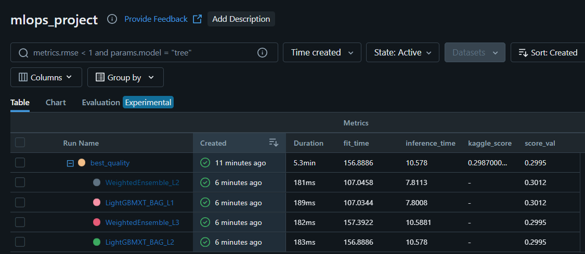

# Introduction (Part 1. from data to model)

Below we will focuse on the initial phase of our project. We begin by acquiring data from a Kaggle competition using the Kaggle API, followed by optimizing data types to reduce memory usage. We then prepare the data for automated feature engineering using the [OpenFE](https://github.com/IIIS-Li-Group/OpenFE) framework. Next, we build a machine learning model with [AutoGluon](https://auto.gluon.ai/stable/index.html) (AutoML) and track experiments using MLflow. We retrieve the model from an S3 bucket with MlflowClient, make predictions on the test set, and submit the results to Kaggle.

The part 2 we will cover model deployment as web-service, monitoring with Prometheus and Grafana.

---
---
## Table of Contents
- [Importing Libraries](#importing-libraries)
- [Connecting to Kaggle Competition and Downloading Data](#connecting-to-kaggle-competition-and-downloading-data)
- [Data Preprocessing](#data-preprocessing)
- [Automated Feature Engineering using OpenFE](#automated-feature-engineering-using-openfe)
- [Model Building using AutoGluon and Tracking using MLflow Server](#model-building-using-autogluon-and-tracking-using-mlflow-server)
- [Submitting Results to Kaggle Competition and Storing Results in MLflow](#submitting-results-to-kaggle-competition-and-storing-results-in-mlflow)
- [Conclusion and Next Steps](#conclusion-and-next-steps)
---
---

### Importing Libraries
---
You can notice below that most of the code is wrapped in custom modules. 

[kaggle_client](modules/kaggle_client.py) - is a convinient wrapper class that streamlines interactions with Kaggle competitions. It offers functionality for downloading competition data (train, test and sumbition files) and submitting predictions, making it easier to participate in Kaggle competitions programmatically.

Features:
  - Automatic Data Management: Creates a data folder and downloads raw competition data (train, test, and submission files) into it.
  - Environment Variable Handling: Utilizes a .env file for secure storage of Kaggle credentials.
  - Data Download: Fetches and extracts competition data files from Kaggle.
  - Submission Handling: Submits prediction files to the competition and retrieves the public score.
---

[data_preprocesing](modules/data_preprocesing.py) - this is a class that helps to optimize data types to save memory and rename columns to feed the data to automated feature generation framework OpenFE.

Features:
  - Optimizes data types to reduce memory usage
  - Converts object columns to category or datetime
  - Downcasts numeric columns (int and float)
  - Converts float columns to int when possible
  - Adjusts column names for consistency
  - Stores processed data and metadata
---

[feature_engineering](modules/feature_engineering.py) - is a wrapper around [OpenFE](https://github.com/IIIS-Li-Group/OpenFE) automated feature generation for tabular data. In a nutshell this framework helps to identify some of the feature interactions or modification that add to predictive power of the model. 

Features:
  - Stratified sample of data. (To be able to reduce the size of the data such that we can run auto feature generation faster and without loosing a lot of information about distribution of the data)
  - Automated feature generation using OpenFE
  - Data transformation with generated features
---

[mlflow_client](modules/mlflow_client.py) - is a wrapper class that automates the process of model selection and hyperparameter tuning using AutoML framefowrk [AutoGluon](https://auto.gluon.ai/stable/index.html). We use MLflow to track our experiments, which helps in comparing different models and configurations.

Features:
  - MLflow server setup and management 
  - Experiment creation and tracking 
  - AutoGluon model training with various presets
  - Model performance logging and artifact storage
  - Support for local and remote MLflow tracking servers
  - Ability to downsize the model for deployment purposes 

```python
import pandas as pd
import os
import sys
import json
from mlflow.tracking import MlflowClient
from autogluon.tabular import TabularPredictor
import logging
from dotenv import load_dotenv, find_dotenv

# Make sure that correct .env is loaded
load_dotenv(find_dotenv(filename="mlops_project.env", usecwd=True, raise_error_if_not_found=True))
project_path = os.getenv("PROJECT_PATH")
print(f"project path {project_path}")

# Make sure that the project path is in the sys.path to be able to import modules
if project_path not in sys.path:
    sys.path.append(project_path)

# Import custom modules
from modules.kaggle_client import KaggleClient 
from modules.data_preprocesing import DataPreprocessor 
from modules.feature_engineering import FeatureEnginering 
from modules.mlflow_client import MLflowAutoGluon 
from modules.download_folder_s3 import download_s3_folder, list_files_in_s3_folder 
```
    project path /workspaces/MLOPs-homeworks/project/mlops_project

---
---
### Connecting to Kaggle Competition and Downloading Data
---
We are using one of the tabular playground searies [Regression with a Tabular Media Campaign Cost Dataset](https://www.kaggle.com/competitions/playground-series-s3e11/overview) that aim to predict the cost of media campaign. This analysis could be easily replicated to other tabular series by changing below parameters.

```python
# Define the competition name and target column
competition_name = "playground-series-s3e11"
autogluon_preset = ['best_quality']
run_time = 4 # in minutes
target = "cost"
```

```python
# Initialize KaggleClient to be able to talk to kaggle API
kaggle_client = KaggleClient(competition_name=competition_name, target_column=target)
# Downloads raw data for a given competition locally to the data folder
kaggle_client.download_data()
# Show the content of the data folder
os.listdir(f"{project_path}/data/{competition_name}/raw")
```

    Data downloaded /workspaces/MLOPs-homeworks/project/mlops_project/data/playground-series-s3e11/raw

    ['train.csv', 'test.csv', 'sample_submission.csv']
---
---
### Data Preprocessing
---
Here were will perform some data types optimization techniques to reduce the storage size and efficiency of the models that we are building. Some of the optimization techniques include:
1) Downcasting numeric columns to reduce memory usage.
2) Converting object columns to category or datetime columns based on uniqueness.
3) Converting float columns to integer columns if all fractional parts are 0.
4) Replacing some of the special characters in column names to '_' to be able to feed the dataset to OpenFE.

All the data type changes and column name transformations will be stored in convinient json file.

```python
# Preprocess data to adjust data types and reduce memory usage
logging.basicConfig(level=logging.INFO, format="%(asctime)s - %(name)s - %(levelname)s - %(message)s")

data_preprocessor = DataPreprocessor(competition_name)
train = pd.read_csv(os.path.join(data_preprocessor.df_raw_path, "train.csv"))
test = pd.read_csv(os.path.join(data_preprocessor.df_raw_path, "test.csv"))
submission = pd.read_csv(os.path.join(data_preprocessor.df_raw_path, "sample_submission.csv"))
```

```python
# Sample data before preprocessing
train.head(5).T
```

<div>
<table border="1" class="dataframe">
  <thead>
    <tr style="text-align: right;">
      <th></th>
      <th>0</th>
      <th>1</th>
      <th>2</th>
      <th>3</th>
      <th>4</th>
    </tr>
  </thead>
  <tbody>
    <tr>
      <th>id</th>
      <td>0.00</td>
      <td>1.00</td>
      <td>2.00</td>
      <td>3.00</td>
      <td>4.00</td>
    </tr>
    <tr>
      <th>store_sales(in millions)</th>
      <td>8.61</td>
      <td>5.00</td>
      <td>14.08</td>
      <td>4.02</td>
      <td>2.13</td>
    </tr>
    <tr>
      <th>unit_sales(in millions)</th>
      <td>3.00</td>
      <td>2.00</td>
      <td>4.00</td>
      <td>3.00</td>
      <td>3.00</td>
    </tr>
    <tr>
      <th>total_children</th>
      <td>2.00</td>
      <td>4.00</td>
      <td>0.00</td>
      <td>5.00</td>
      <td>5.00</td>
    </tr>
    <tr>
      <th>num_children_at_home</th>
      <td>2.00</td>
      <td>0.00</td>
      <td>0.00</td>
      <td>0.00</td>
      <td>0.00</td>
    </tr>
    <tr>
      <th>avg_cars_at home(approx).1</th>
      <td>2.00</td>
      <td>3.00</td>
      <td>3.00</td>
      <td>0.00</td>
      <td>3.00</td>
    </tr>
    <tr>
      <th>gross_weight</th>
      <td>10.30</td>
      <td>6.66</td>
      <td>21.30</td>
      <td>14.80</td>
      <td>17.00</td>
    </tr>
    <tr>
      <th>recyclable_package</th>
      <td>1.00</td>
      <td>1.00</td>
      <td>1.00</td>
      <td>0.00</td>
      <td>1.00</td>
    </tr>
    <tr>
      <th>low_fat</th>
      <td>0.00</td>
      <td>0.00</td>
      <td>0.00</td>
      <td>1.00</td>
      <td>1.00</td>
    </tr>
    <tr>
      <th>units_per_case</th>
      <td>32.00</td>
      <td>1.00</td>
      <td>26.00</td>
      <td>36.00</td>
      <td>20.00</td>
    </tr>
    <tr>
      <th>store_sqft</th>
      <td>36509.00</td>
      <td>28206.00</td>
      <td>21215.00</td>
      <td>21215.00</td>
      <td>27694.00</td>
    </tr>
    <tr>
      <th>coffee_bar</th>
      <td>0.00</td>
      <td>1.00</td>
      <td>1.00</td>
      <td>1.00</td>
      <td>1.00</td>
    </tr>
    <tr>
      <th>video_store</th>
      <td>0.00</td>
      <td>0.00</td>
      <td>0.00</td>
      <td>0.00</td>
      <td>1.00</td>
    </tr>
    <tr>
      <th>salad_bar</th>
      <td>0.00</td>
      <td>0.00</td>
      <td>0.00</td>
      <td>0.00</td>
      <td>1.00</td>
    </tr>
    <tr>
      <th>prepared_food</th>
      <td>0.00</td>
      <td>0.00</td>
      <td>0.00</td>
      <td>0.00</td>
      <td>1.00</td>
    </tr>
    <tr>
      <th>florist</th>
      <td>0.00</td>
      <td>0.00</td>
      <td>0.00</td>
      <td>0.00</td>
      <td>1.00</td>
    </tr>
    <tr>
      <th>cost</th>
      <td>62.09</td>
      <td>121.80</td>
      <td>83.51</td>
      <td>66.78</td>
      <td>111.51</td>
    </tr>
  </tbody>
</table>
</div>


Based on the logging below, you can notice that storage memory reduced by around 78% which is pretty significant, given that we did not loose much information in converting these columns to more optimal data types.

```python
# Preprocessing data
train = data_preprocessor.optimize_dtypes(train)
test = data_preprocessor.optimize_dtypes(test)
```
Memory reduction summary for Train and Test sets:

    - Initial memory usage: 0.045640 GB
    - Final memory usage: 0.010739 GB
    - Memory reduced by 0.034901 GB (76.47%).
    - Data stored in     data/playground-series-s3e11/preprocessed/data_dtype_optimized.pkl
    - JSON data saved to data/playground-series-s3e11/preprocessed/column_changes.json
    - JSON data saved to data/playground-series-s3e11/preprocessed/dtype_changes.json

    - Initial memory usage: 0.028637 GB
    - Final memory usage: 0.006264 GB
    - Memory reduced by 0.022373 GB (78.12%).
    - Data stored in     data/playground-series-s3e11/preprocessed/data_dtype_optimized.pkl
    - JSON data saved to data/playground-series-s3e11/preprocessed/column_changes.json
    - JSON data saved to data/playground-series-s3e11/preprocessed/dtype_changes.json

You can see the mapping of old column names to new columns from json file that we stored after preprocessing.

```python
# Renaming columns
with open("/workspaces/MLOPs-homeworks/project/mlops_project/data/playground-series-s3e11/preprocessed/column_changes.json", "r") as f:
    column_changes = json.load(f)
column_changes = pd.Series(column_changes)
column_changes
```
Old and New column mapping:

    id                                                    id
    store_sales(in millions)        store_sales_in_millions_
    unit_sales(in millions)          unit_sales_in_millions_
    total_children                            total_children
    num_children_at_home                num_children_at_home
    avg_cars_at home(approx).1    avg_cars_at_home_approx__1
    gross_weight                                gross_weight
    recyclable_package                    recyclable_package
    low_fat                                          low_fat
    units_per_case                            units_per_case
    store_sqft                                    store_sqft
    coffee_bar                                    coffee_bar
    video_store                                  video_store
    salad_bar                                      salad_bar
    prepared_food                              prepared_food
    florist                                          florist
    dtype: object


```python
# Optimizing data types
with open("/workspaces/MLOPs-homeworks/project/mlops_project/data/playground-series-s3e11/preprocessed/dtype_changes.json", "r") as f:
    dtype_changes = json.load(f)
df_dtype_changes = pd.DataFrame(dtype_changes)
df_dtype_changes.T
```
Below you can see what were the data types changes, you can notice that some of the heavy float64 data types moved to int8, that significantly reduced that memory usage.

<div>
<table border="1" class="dataframe">
  <thead>
    <tr style="text-align: right;">
      <th></th>
      <th>old_dtype</th>
      <th>new_dtype</th>
    </tr>
  </thead>
  <tbody>
    <tr>
      <th>low_fat</th>
      <td>float64</td>
      <td>int8</td>
    </tr>
    <tr>
      <th>store_sqft</th>
      <td>float64</td>
      <td>int32</td>
    </tr>
    <tr>
      <th>total_children</th>
      <td>float64</td>
      <td>int8</td>
    </tr>
    <tr>
      <th>recyclable_package</th>
      <td>float64</td>
      <td>int8</td>
    </tr>
    <tr>
      <th>salad_bar</th>
      <td>float64</td>
      <td>int8</td>
    </tr>
    <tr>
      <th>avg_cars_at_home_approx__1</th>
      <td>float64</td>
      <td>int8</td>
    </tr>
    <tr>
      <th>unit_sales_in_millions_</th>
      <td>float64</td>
      <td>int8</td>
    </tr>
    <tr>
      <th>florist</th>
      <td>float64</td>
      <td>int8</td>
    </tr>
    <tr>
      <th>units_per_case</th>
      <td>float64</td>
      <td>int8</td>
    </tr>
    <tr>
      <th>gross_weight</th>
      <td>float64</td>
      <td>float32</td>
    </tr>
    <tr>
      <th>prepared_food</th>
      <td>float64</td>
      <td>int8</td>
    </tr>
    <tr>
      <th>video_store</th>
      <td>float64</td>
      <td>int8</td>
    </tr>
    <tr>
      <th>store_sales_in_millions_</th>
      <td>float64</td>
      <td>float32</td>
    </tr>
    <tr>
      <th>coffee_bar</th>
      <td>float64</td>
      <td>int8</td>
    </tr>
    <tr>
      <th>num_children_at_home</th>
      <td>float64</td>
      <td>int8</td>
    </tr>
    <tr>
      <th>id</th>
      <td>int64</td>
      <td>int32</td>
    </tr>
  </tbody>
</table>
</div>

---
---
### Automated Feature Engineering using OpenFE library
---
We use open source package [OpenFE](https://github.com/IIIS-Li-Group/OpenFE) for automated feature engineering. It takes time to run this process on relatevilly large datasets, thus we perform stratified sampling to be able to create features faster. More in depth analysis about this technique and effect of new features on model performance you can find it this [Medium article](paste a link).

```python
# Feature engineering with OpenFE
feature_engineering = FeatureEnginering(competition_name, target_column="cost")
train_transformed, test_transformend = feature_engineering.openfe_transform(train, test)

# Saving transformed data
train_transformed = pd.read_pickle(
    filepath_or_buffer=f"{project_path}/data/{competition_name}/feature_engineered/train_transformed.pkl"
)
test_transformed = pd.read_pickle(
    filepath_or_buffer=f"{project_path}/data/{competition_name}/feature_engineered/test_transformed.pkl"
)

```

    The top 5 generated features are:

    GroupByThenMean(video_store,store_sqft)
    Combine(store_sqft,salad_bar)
    (store_sqft/florist)
    CombineThenFreq(total_children,store_sqft)
    (avg_cars_at_home_approx__1/store_sqft)
---
---
### Model Building using AutoGluon and Tracking using MLflow Server
---
For model building, we will use the AutoML library AutoGluon, which provides an easy way to create an ensemble of models with hyperparameter tuning in a few lines of code. We will use an MLflow server on EC2 with an S3 bucket as the artifact store to keep track of model performance. AutoGluon offers a way to store the model specifically for deployment, reducing the memory requirements. We will use this model in part 2 for deployment as a web service.

```python
# Create autogloun model using MlfLow server in EC2 and store artifacts in S3
# You need to make sure that EC2 instance is running the server
tracking_server = os.getenv("TRACKING_SERVER_HOST")
artifact_path_s3 = os.getenv("AWS_BUCKET_NAME")
experiment_name = "mlops_project"
```

```python
mlflow_autogluon_remote_aws_ec2 = MLflowAutoGluon(
    tracking_server="remote",
    backend_store=tracking_server,
    artifact_location=f"s3://{artifact_path_s3}",
    experiment_name=experiment_name,
    competition_name=competition_name,
    target_name=target,
)
mlflow_autogluon_remote_aws_ec2.train_and_log_model(
    presets=autogluon_preset,
    target=target,
    train_transformed=train_transformed,
    test_transformed=test_transformed,
    run_time=4,
)
```
---
---
### Submitting Results to Kaggle Competition and Storing Results in MLflow
---
We will use our model to create predictiong for Kaggle competition and use Kaggle API to submit our results. For that we will use MlflowClient to get the experiment name, experiment id and run_id. We will need this information to download the model from s3 bucket locally to perform prediction on test set.

```python
# Lets pull the model from s3 bucket where we stored it 
# For that we need to get the empexperiment id and run id using MflfowClient
mlflow_client = MlflowClient(f'http://{tracking_server}:5000')
experiment = mlflow_client.get_experiment_by_name(experiment_name)

print("---")
print(f"Experiment ID: {experiment.experiment_id}")
print(f"Name: {experiment.name}")
print(f"Artifact Location: {experiment.artifact_location}")
print(f"Lifecycle Stage: {experiment.lifecycle_stage}")
print("---")
```

    ---
    Experiment ID: 3
    Name: mlops_project
    Artifact Location: s3://mlflow-artifact-ag3
    Lifecycle Stage: active
    ---

```python
run_name = autogluon_preset[0]

# Search for runs with the specified run name
runs = mlflow_client.search_runs(
    experiment_ids=[experiment.experiment_id],
    filter_string=f"tags.mlflow.runName = '{run_name}'"
)

experiment_id = experiment.experiment_id
if runs:
    run_id = runs[0].info.run_id
    print(f"Experiment ID: {experiment.experiment_id}, Run ID: {run_id}")
else:
    print("No run found with the specified name.")
```

    Experiment ID: 3, Run ID: 62f1decc0ef14c0a80d3aef1e1643018


I created a convinient function [list_files_in_s3_folder](modules/download_folder_s3.py) to list the contents of the s3 folder where we stored our model.


```python
s3_folder = f"{run_id}/artifacts/AutoGluon_mlflow_best_quality_deployment/artifacts/AutoGluon_mlflow_best_quality_deployment/"
list_files_in_s3_folder(bucket_name=artifact_path_s3, s3_folder=s3_folder)
```

Based on my research you can pull files one at a time from s3 bucket, but there is no direct way to download the folder with all its contents. I built the function [download_s3_folder](modules/download_folder_s3.py) that does that. Below we store our model locally to further use it for predicting on the test set and deploy it as web service.

```python
download_s3_folder(bucket_name=artifact_path_s3, 
                   s3_folder=s3_folder, 
                   local_dir=f"{project_path}/model/{competition_name}")
```
Autogluon provides a convinient way to load the model using TabularPredictor.load method, we use it to bring in model and create predictions for the test set. We store results as csv file to further submit it to Kaggle competetion.

```python
# Load the model for predictions 
predictor = TabularPredictor.load(f"{project_path}/model/{competition_name}")
# Create a folder for submitions 
submission_path = f"data/{competition_name}/submission_files"
os.makedirs(submission_path, exist_ok=True)
# Make predictions
submission[target] = predictor.predict(test_transformed)
submission_file = f"{submission_path}/sub_{run_time}_{autogluon_preset}.csv"
submission.to_csv(submission_file, index=False)
```
We use our kaggle client to submit the results to the competition and get the score back.

```python
# Submit the file to Kaggle
kaggle_score = kaggle_client.submit(
    submission_file=submission_file,
    model_name=autogluon_preset,
    message=f"AutoGluon {autogluon_preset} {run_time} min",
)
```
    Submission data/playground-series-s3e11/submission_files/sub_4_['best_quality'].csv for playground-series-s3e11 using ['best_quality']: 'AutoGluon ['best_quality'] 4 min'
    Submission score: 0.2987

Below we store kaggle score in Mlflow for our experiment. 

```python
# Log the new metric to the existing run
metric_name = "kaggle_score"
metric_value = kaggle_score

# Log the kaggle score
mlflow_client.log_metric(run_id, metric_name, metric_value)
```
In the screenshot below you can see, the results from AutoGluon model run with kaggle score. 

```python
from PIL import Image
from IPython.display import display
image = Image.open(f"{project_path}/MlfLow_summary.png")
display(image)
```


    

    


Within MlflowAutogluon class I have implemented 2 other options to track experiments: 
1) No tracking server, with local backend and artifact store
2) With local tracking server, with sqlite backend store and local filesystem for artifacts.

For the sake of simplicity I left them here commented, but user can try them on if needed.


```python
# Scenario 2:
## Tracking server: no
## Backend store: local filesystem
## Artifacts store: local filesystem

## --------------------
# mlflow_autogluon_local = MLflowAutoGluon(
#     tracking_server="no",
#     backend_store=f"{project_path}/mlruns",
#     artifact_location=f"{project_path}/mlruns",
#     experiment_name="test",
#     competition_name=competition_name,
#     target_name=target,
# )
# mlflow_autogluon_local.train_and_log_model(
#     presets=["medium_quality"],
#     target=target,
#     train_transformed=train_transformed,
#     test_transformed=test_transformed,
#     run_time=1,
#     for_deployment=True,
#     for_kaggle_submission=False,
# )
## --------------------
```


```python
# Scenario 3:
## tracking server: yes, local server
## backend store: sqlite database
## artifacts store: local filesystem

## --------------------
# mlflow_autogluon_local_server = MLflowAutoGluon(
#     tracking_server="local",
#     backend_store=f"{project_path}/backend.db",
#     artifact_location=f"{project_path}/mlruns",
#     experiment_name="test_32",
#     competition_name=competition_name,
#     target_name=target,
# )
# mlflow_autogluon_local_server.train_and_log_model(
#     presets=["best_quality"],
#     target=target,
#     train_transformed=train_transformed,
#     test_transformed=test_transformed,
#     run_time=1,
# )
## --------------------
```

### Conclusion and Next steps

....