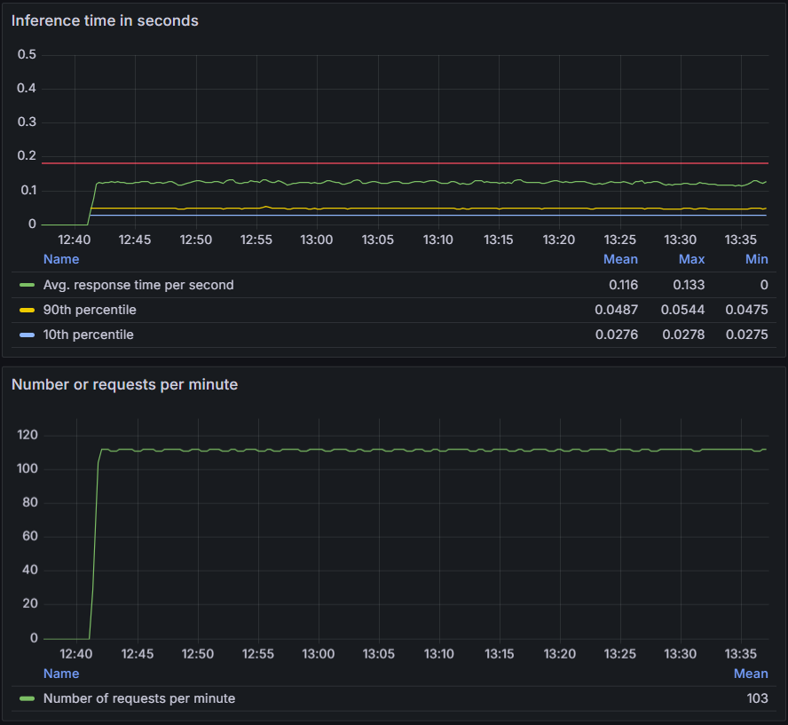

# Introduction (Part 2: Model Deployment as a Web Service)

```
                                        +--------------------------+
                                        |      User Requests       |
                                        +------------+-------------+
                                                    |
                                                    v
                            +------------------------------------------------------+
                            |                    Docker Network                    |
                            |                  (Containerization)                  |
                            |                                                      |
                            |  +-----------------+   +--------------------------+  |
                            |  |  Flask App      |   |     Prometheus Server    |  |
                            |  |  (Gunicorn)     |   |   (Metrics Collection)   |  |
                            |  | Ports: 9696,8000|   |        Port: 9090        |  |
                            |  +--------+--------+   +-----------+--------------+  |
                            |           |                        |                 |
                            |           |                        |                 |
                            |           v                        v                 |
                            |  +--------------------------------------------+      |
                            |  |                  Grafana                   |      |
                            |  |             (Metrics Dashboard)            |      |
                            |  |                Port: 3000                  |      |
                            |  +--------------------------------------------+      |
                            +------------------------------------------------------+

```

In this second part of our project, we focus on deploying the machine learning model created earlier as a web service. This deployment will enable real-time predictions and performance monitoring. We'll utilize the following technologies:

- Flask: A lightweight Python web application framework
- Gunicorn: A WSGI HTTP Server for UNIX
- Docker: For application containerization
- Prometheus: For metrics collection and monitoring
- Grafana: For metric visualization

Our Flask application, running with Gunicorn, will be containerized using Docker. This approach ensures consistency across environments and simplifies deployment. Prometheus will track key performance metrics such as inference time and request count, which will be visualized in real-time using Grafana dashboards.

To facilitate communication while maintaining isolation and security, all components will operate within a Docker network. This setup allows for seamless interaction between different parts of the system.

By implementing this architecture, we aim to create a robust, scalable, and observable machine learning service that can handle real-world prediction requests efficiently.

---
---

## Table of Contents
- [Flask Application](#flask-application)
- [Creating Docker Containers](#creating-docker-network)
- [Docker Container](#docker-container)
- [Simulate Requests](#simulate-requests)
- [Creating Simple Grafana Dashboard](#creating-simple-grafana-dashboard)
- [Conclusion and Next Steps](#conclusion-and-next-steps)
---
---

### Flask Application
---

Our Flask application, which serves as the core of our web service, is stored in the file [predict.py](web_service_mlflow_visualiztion/predict.py). This application is responsible for loading our trained model from an S3 bucket and using it to make predictions based on incoming requests.

First, we set up the connection to our S3 bucket and load the model we stored in part 1 of the project. We use environment variables to securely manage our AWS credentials and other configuration details:

```python
# Specify your bucket name and model file path
AWS_BUCKER_NAME = os.getenv("AWS_BUCKET_NAME")
experiment_id = os.getenv("EXPERIMENT_ID")
AWS_ACCESS_KEY_ID = os.getenv("AWS_ACCESS_KEY_ID")
AWS_SECRET_ACCESS_KEY = os.getenv("AWS_SECRET_ACCESS_KEY")

# Initialize the S3 client
s3 = boto3.client("s3")

# Download the folder from s3
s3_model_folder = f"{experiment_id}/artifacts/AutoGluon_mlflow_best_quality_deployment/artifacts/AutoGluon_mlflow_best_quality_deployment/"
local_model_path = "model_ag_deployment"

# Ensure the local folder path exists
os.makedirs(local_model_path, exist_ok=True)

# download the model from s3
download_s3_folder(bucket_name=AWS_BUCKER_NAME, s3_folder=s3_model_folder, local_dir=local_model_path)

# Load the model from the local file
try:
    predictor = TabularPredictor.load("model_ag_deployment")
except Exception as e:
    raise RuntimeError(f"Failed to load model: {e}")
```

Next, we define two Prometheus metrics that we'll use to monitor our application's performance. These metrics will allow us to track the time taken to process each request and the total number of requests received, providing valuable insights into our application's performance and usage patterns.

```python 
# Prometheus metrics
REQUEST_TIME = Histogram('request_processing_seconds', 'Time spent processing request')
REQUEST_COUNTER = Counter('request_count', 'Number of requests received')
```

The heart of our Flask application is the prediction endpoint. This endpoint accepts POST requests with JSON data, uses our loaded model to make a prediction, and returns the result as a JSON response. It also tracks the time spent processing each request using the Prometheus histogram.

We start a separate thread to run a Prometheus metrics server, which listens on port 8000. This allows Prometheus to scrape our application for metrics periodically.
Finally, we run our Flask application on port 9696, making it accessible for incoming prediction requests.

```python 
# Define predict endpoint
@app.route("/predict", methods=["POST"])
@REQUEST_TIME.time()
def predict_endpoint():
    REQUEST_COUNTER.inc()
    start_time = time.time()
    try:
        # Get the JSON data from the request
        data = request.get_json()

        # Convert the data to a TabularDataset for AutoGluon model
        data_df = TabularDataset([data])

        # Make the prediction using the loaded model
        pred = predictor.predict(data_df)[0]
        result = {"cost": round(float(pred), 2)}

        # Return the prediction result as JSON
        return jsonify(result)
    except Exception as e:
        # Return error message if an exception occurs
        return jsonify({"error": str(e)}), 400
    finally:
        # Calculate the inference time
        duration = time.time() - start_time
        REQUEST_TIME.observe(duration)

# Function to start the Prometheus metrics server
def start_metrics_server():
    start_http_server(8000)

# Start the metrics server in a separate thread
threading.Thread(target=start_metrics_server, daemon=True).start()

if __name__ == "__main__":
    start_http_server(8000)  # Start the Prometheus metrics server
    app.run(host="0.0.0.0", port=9696, debug=True)
```

---
---

## Creating Docker Containers

To ensure our web application components can communicate effectively while maintaining isolation, we'll create a Docker network and deploy our containers within it.

### Docker Network

First, we create a Docker network named "monitoring":

```bash 
cd web_service_mlflow_visualiztion
docker network create monitoring
```

This network will allow our containers to communicate with each other using their container names as hostnames.

### Start Prometheus

We start Prometheus on port 9090, using a custom configuration file and connecting it to our "monitoring" network:

```bash 
docker rm -f prometheus && \
docker run -d --name=prometheus --network=monitoring -p 9090:9090 -v $(pwd)/prometheus.yml:/etc/prometheus/prometheus.yml prom/prometheus
```

This command removes any existing Prometheus container, then starts a new one with our custom configuration.

### Start Grafana

Next, we start Grafana on the same Docker network, exposing it on port 3000:

```bash
docker rm -f grafana && \
docker run -d --name=grafana --network=monitoring -p 3000:3000 grafana/grafana
```

### Start Flask App

Finally, we build and start our Flask application:  

```bash 
docker rm -f flask_app 
docker build -t flask_app . 
docker run -d --name=flask_app --network=monitoring -p 9696:9696 flask_app
```

This process might take some time as it involves installing the AutoGluon library in the Docker container.

After completing these steps, our web service will be up and running, with all components able to communicate via the Docker network.

---
---

## Simulate Requests

To test our deployed service and verify that Prometheus is successfully collecting data, we can simulate user requests using the [test_multiple_requests.py](web_service_mlflow_visualiztion/test_multiple_requests.py) script:

```bash 
python test_multiple_requests.py --num_requests 5
```

This will send 5 test requests to our service. The output should look something like this:

```
{'cost': 103.35}
{'cost': 103.35}
{'cost': 103.35}
{'cost': 103.35}
{'cost': 103.35}
```

These consistent results indicate that our model is successfully loaded and making predictions.

These steps are automated using [Makefile](web_service_mlflow_visualiztion/Makefile).
To execute it, run this in terminal:

```bash 
cd /web_service_mlflow_visualiztion
make 
```

---
---

## Creating Simple Grafana Dashboard

To visualize the performance metrics of our deployed model, we create a Grafana dashboard. This dashboard focuses on two key aspects:

1. Inference Time: We display the mean, 90th percentile, and 10th percentile of inference times to get a comprehensive view of our model's performance.
2. Request Volume: We show the total number of requests received in the last minute to understand the current load on our application.

Here's an example of what our Grafana dashboard might look like:


